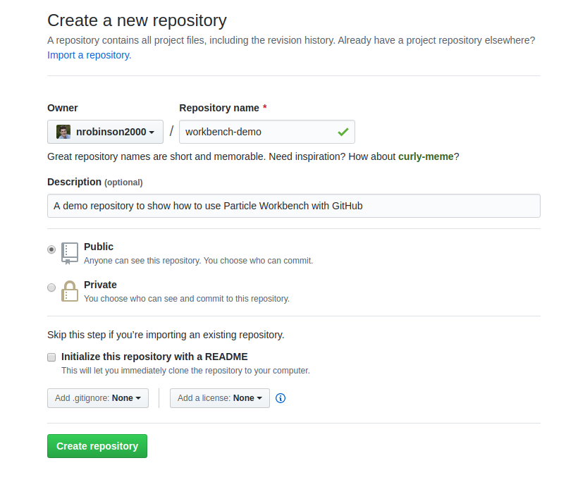
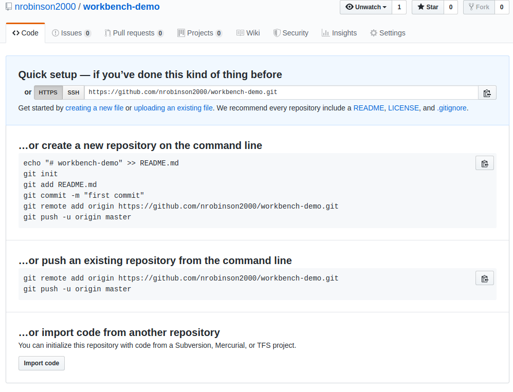
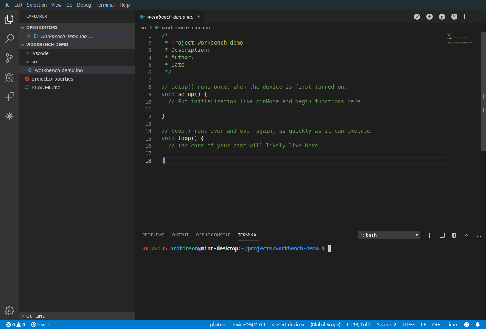
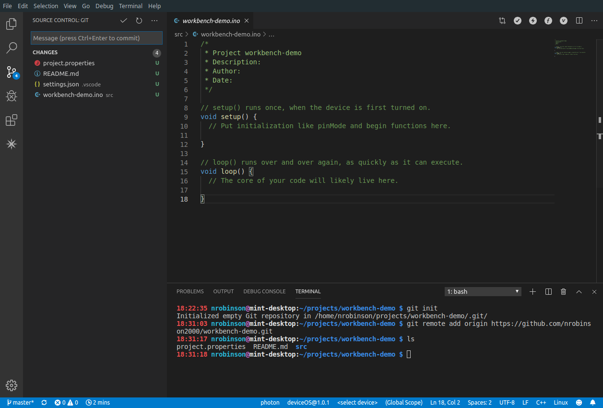
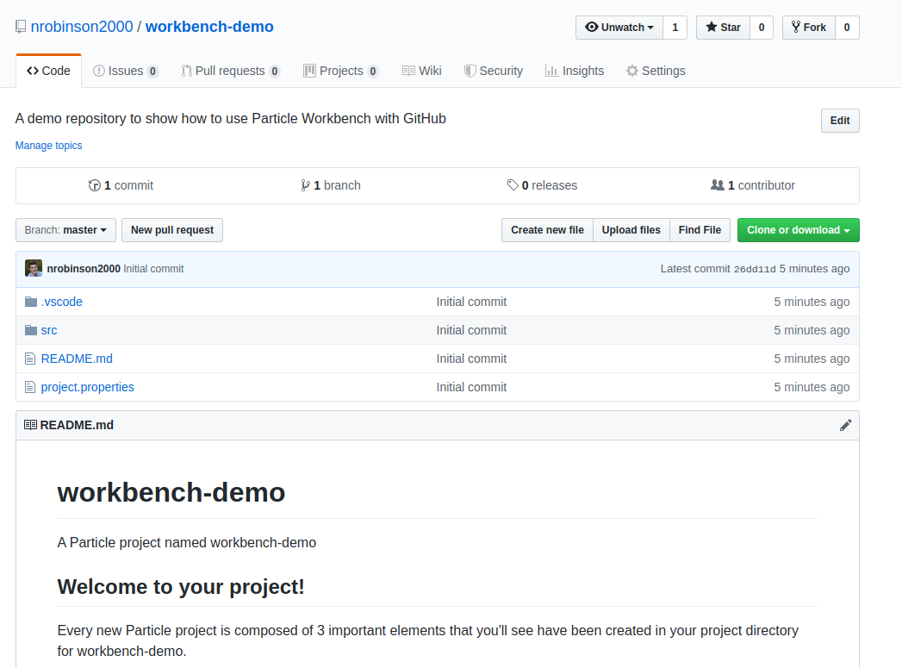

# workbench-demo

Copied from: https://community.particle.io/t/working-with-github-remote/51939/2?u=nrobinson2000

So I think the best first step would be to create a new repository on GitHub that you will connect to your project in Workbench.

<https://github.com/new>

 

Enter a Repository Name and leave **Initialize this repository with a README** unchecked.

Click <kbd>Create Repository</kbd>.

You will then see this screen.

 

From the **…or push an existing repository from the command line** section, copy the entire line beginning with `git remote add origin` to your clipboard. You will need this later.

Next, open your project folder in Visual Studio Code.

Open the Terminal by clicking the Problem menu on the bottom left, under the settings gear, and then click on TERMINAL. A terminal should open.

 

In the terminal enter the following commands:
```
git init
# This will create a git repository out of your project folder.
git remote add origin https://github.com/...
# This is the line that you copied from GitHub
```

Your project folder is now a git repository and connected to GitHub. You should see the pending changes in the Source Control tab.

 

To upload the current state of your project to GitHub you can enter a commit message, click the plus to stage all changes, and then click the check to commit.

Next, you will need to push the commit to GitHub.

Click the push button on the bottom left to open the push menu. VSCode will ask for your GitHub credentials and then push your commit to the repository on GitHub.

An easy way to confirm that the push worked is to refresh the repository page on GitHub. You should see your files and information about your commit.

 

That's the basics of getting a workbench project up on GitHub. Let me know if you have any questions.
